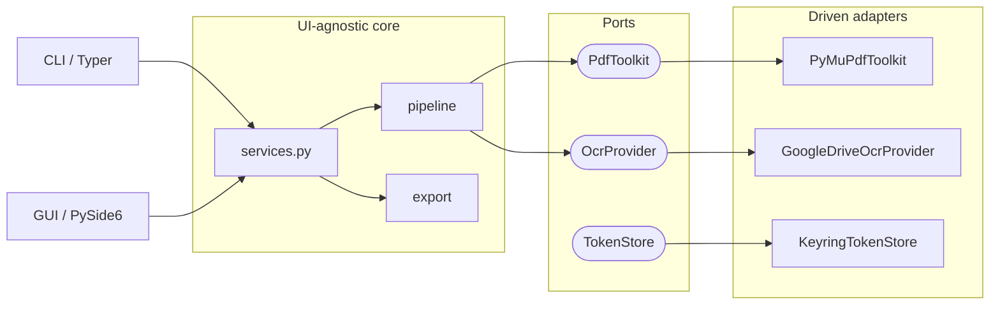
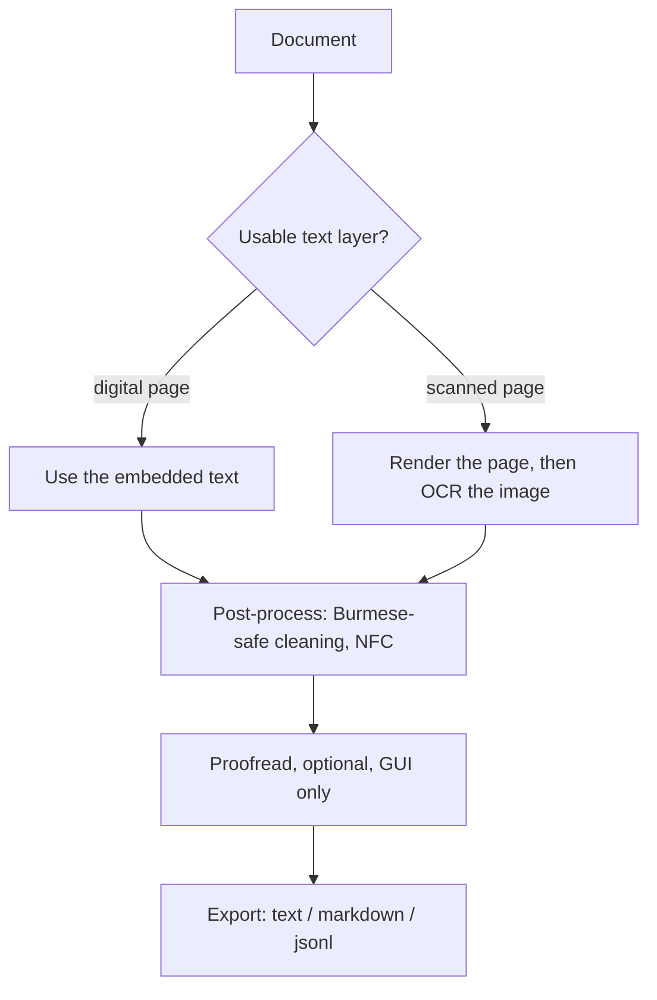

# Lexo Architecture

Lexo is a from-scratch rebuild of the old OCR Text Extractor into a
local-first desktop document OCR tool. This is the single design reference;
user-facing usage lives in the [README](../README.md).

## Principles

- **Local-first.** Documents and outputs stay on the machine. The only network
  call is the optional OCR provider, which uses the user's own Google account.
- **Desktop-only.** A native PySide6 app and a scriptable CLI are the two faces;
  there is no mobile or web target.
- **Document-centric.** The unit of work is a document (a PDF, an image, or an
  image set). An image is the degenerate one-page case.
- **Hexagonal.** A UI-agnostic core exposes swappable ports. The CLI and the GUI
  are thin adapters over the same engine, so behaviour is consistent.
- **Burmese-first accuracy.** Free Google Docs OCR plus Unicode-correct text
  handling is the headline capability.

## How the pieces fit

A UI-agnostic core does all the real work. `services.py` exposes that core as a
handful of use cases (extract, OCR, export). The CLI and the GUI are thin
adapters that call those use cases and render the result; they hold no document
logic of their own. New OCR engines or UIs attach at the edges (ports and
adapters) without touching the core.

The driving adapters (CLI, GUI) call the core; the core calls the outside world
only through ports, which the driven adapters implement.

### Core (UI-agnostic, in `src/lexo/`)

- `domain/` - pure data: models, engine events, and page-range parsing. No I/O.
- `ports/` - the Protocols the core depends on: `PdfToolkit` (PDF operations),
  `OcrProvider` (one page in, text out), and `TokenStore` (credential storage).
- `pdf/` - `PyMuPdfToolkit`, the `PdfToolkit` implementation (PyMuPDF): inspect,
  extract pages, split, crop, rotate, merge, split two-up spreads, render pages
  to images, and read the embedded text layer.
- `text/` - `extractor` (pull a digital PDF's embedded text) and `burmese`
  (NFC normalization and zero-width-space-safe cleaning).
- `providers/` - `OcrProvider` implementations. Today: `google_drive`.
  `get_provider(name)` is the factory; new engines slot in behind the port.
- `pipeline/` - the OCR machinery: `router` decides per page whether to use the
  embedded text or send the rendered image to OCR; `engine` runs the provider
  over many pages (async, bounded concurrency, per-page retry, cancellation, and
  a progress-event stream); `postprocess` applies the Burmese-safe cleaning.
- `export/` - render an extracted document to `text` (default), `markdown`, or
  `jsonl`.
- `infra/` - the outside world: settings, logging, OS paths (platformdirs),
  file hashing, Google OAuth, and the keyring-backed `TokenStore`.
- `services.py` - the application use cases that tie the above together. GUI-free,
  so the CLI and GUI get identical behaviour.

### Adapters

- `cli/` - the Typer command-line app. A thin wrapper over `services`.
- `gui/` - the PySide6 desktop app, split one module per responsibility:
  - `qt` - the single optional-PySide6 import shim; every other GUI module
    imports Qt through it, so a headless environment fails in one place.
  - `document` - `WorkingDocument`, the Qt-free working-copy model that owns all
    editing and persistence operations.
  - `tune_panel` - the "Tune" dock UI. It only emits request signals and exposes
    the apply scope; it never edits the document directly.
  - `preview` - the page preview, which doubles as the drag-to-crop and
    drag-to-split surface.
  - `worker` - the background extract/OCR `QThread`.
  - `rendering` - the shared page renderer used by both thumbnails and the preview.
  - `resources` - the bundled logo.
  - `app` - the thin launcher (`lexo gui`).
  - `window/` - the `MainWindow`, composed from one mixin per concern: `build`
    constructs the UI, `io` handles open/save/render/proofread text, `editing`
    applies document edits, `run` drives the background extract/OCR, and `shell`
    holds shared state and window plumbing.

  The GUI is an editor-style model. Opening a file copies it to a temp working
  copy; every edit (rotate, crop, split, append, extract, remove pages) applies
  to that copy and updates the preview and thumbnails live, while the original is
  untouched until File > Save / Save As. Edits come from two places: the Tune
  dock (apply scope of this page / all pages / selected pages, plus crop-by-drag
  on the preview) and the pages-strip context menu (multi-select, then rotate /
  extract / remove). Two-up spreads are split by dragging a vertical line on the
  preview rather than typing a ratio.

### Bundled assets (`assets/`)

- `fonts/` - Noto Sans Myanmar (Regular), bundled so Burmese renders in the GUI
  regardless of installed system fonts. Licensed under the SIL Open Font
  License; `OFL.txt` ships alongside the font to satisfy the license.
- `icons/`, `styles/`, `lexo.png` - Material icon font, the dark Qt stylesheet,
  and the app logo.

## Flow

Digital PDF pages use their existing text (instant and lossless); only scanned
pages are OCR'd. `--force-ocr` overrides for documents with a bad text layer.

## OCR provider

The only provider today is **Google Docs OCR**, the friendly name for OCR done
through the Google Drive API. The exact mechanism (`providers/google_drive.py`):

1. The page image is uploaded with Drive API v3 `files.create`, targeting
   `mimeType=application/vnd.google-apps.document` with an `ocrLanguage` hint.
   Converting an image into a Google Doc is what triggers Google's OCR.
2. `files.export` retrieves the resulting Doc as `text/plain`.
3. `files.delete` removes the temporary Doc.

Notes on what this is, and is not:

- It runs on Google's free Drive conversion path on the user's own account, **not**
  the paid Cloud Vision API. There is nothing to pay for.
- The OCR engine is Google's proprietary, server-side OCR (the same one behind
  "Open with Google Docs" on an image). Google publishes no model name or version
  for it, so we describe the mechanism rather than claim a specific model.
- It uses the least-privilege `drive.file` scope, so it only ever sees the temp
  files it creates. The OAuth token is stored in the OS keychain.
- Drive's calls are synchronous, so the provider runs them in a worker thread,
  letting the async engine process pages concurrently.

New providers (e.g. an offline engine) slot in behind the `OcrProvider` port
without touching the engine.

### Why per-page images, not the whole PDF as a Doc

Drive can also OCR an entire PDF in one conversion, which would remove the
rendering, batching, and concurrency code. Lexo deliberately does not do that:

- Page cap. Drive's PDF-to-Doc OCR has long processed only about the first 10
  pages of a PDF; the rest comes back empty. Lexo targets scanned books, so this
  alone is disqualifying. (Worth re-checking over time, as Google changes these
  limits quietly.)
- Loses smart routing. A whole-PDF conversion OCRs every page, including digital
  pages whose embedded text is already perfect, free, and instant. Per-page
  routing only OCRs the pages that actually need it.
- Skips pre-OCR cleanup. Cropping headers/footers, splitting two-up spreads,
  rotating, and choosing the render DPI all improve accuracy and all operate on
  the rendered page image.
- No granularity. A single conversion gives no per-page progress, no per-page
  retry on a transient failure, and no mid-run cancellation.
- Layout noise. Converting a full PDF makes Drive guess at columns and tables;
  per-page `text/plain` export plus Burmese-safe cleaning is more predictable.

## Burmese handling

- `ocrLanguage="my"` hint to Google for higher accuracy.
- Unicode NFC normalization; the zero-width space (U+200B) is preserved (it marks
  Burmese word and line breaks) while real control characters are dropped.
- A Myanmar Unicode font is bundled so Burmese renders everywhere (see
  Bundled assets).

## Distribution

PyPI package, installed with `uv tool install lexo`. No code-signing
certificate; release provenance comes from GitHub Actions Trusted Publishing.
Everything ships in the one install, with no separate system dependencies.
</content>
</invoke>
